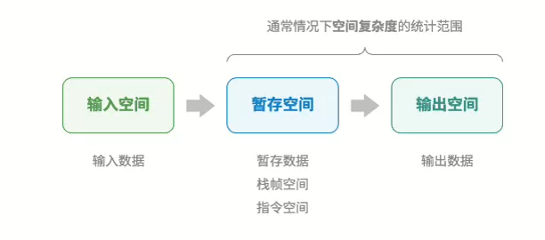
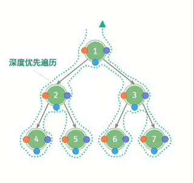

# Hello 算法阅读笔记

[TOC]

## 简介

本算法书来自github的一个万星的开源项目，对于来说初学者是一本算法的入门书籍，对于算法有些经验的来说是算法的复习资料（[github地址](https://github.com/krahets/hello-algo)）。我当时是边刷代码随想录题目边复习巩固算法知识看的，就粗略地从头到尾看了一遍，下面是我看这本算法书的阅读笔记，主要包括一些比较陌生、新颖的算法知识点和一些比较重要的算法知识。

## 第二章 复杂度分析

* 算法的空间复杂度的分类：一般只统计暂存数据、栈帧空间、输出数据三部分（有时候输出数据也不统计）,通常只关注最差空间复杂度（最差输入数据为准，算法运行中的峰值内存和磁盘占用大小）。

  

## 第三章 数据结构分类

**逻辑结构**

* 线性结构：数组、链表、队列、栈、哈希表，元素之间是一对一的顺序关系
* 树形结构（非线性）：树、堆、哈希表，元素之间是一对多的关系
* 网状结构（非线性）：图，元素之间是多对多的关系

**物理结构**

* 分为连续空间储存和分散空间储存，分别对应数组和链表
* 基于数组可以实现：栈、队列、哈希表、树、堆、图、矩阵、张量（维度 ≥ 3 的数组）等
* 基于链表可以实现：栈、队列、哈希表、树、堆、图等

**基本数据**

* 是指可以直接被CPU进行运算的类型

**字符编码**

* UTF-8是Unicode编码方法的一种实现，其他的实现有UTF-16,其中UTF—8是一种变长编码，UTF—16是一种定长编码，计算机更好取值，可以做到立即取值
* Java的String类型采用UTF-16编码，超过16位的字符有额外的处理机制
* 在文件存储和网络传输中我们一般采用UTF-8编码

## 第四章 数组与链表

**列表**

* 表示元素的有序集合，支持元素增删改查功能，而不需要考虑容量限制问题，可以基于链表或数组实现。
* 基于数组的实现的话，需要考虑扩容的问题，一般是扩容二倍。

**内存与缓存**

* 相比链表来说，数组具有更好的空间局部性，故缓存命中率一般更高，故基于数组实现的算法一般更加受欢迎。
* 数组特别在需要大量计算的情况下很受欢迎，例如：AI模型等。

## 第五章 栈与队列

**栈**

* 栈可以视为一种受限制的数组或链表。换句话说，我们可以“屏蔽”数组或链表的部分无关 操作，使其对外表现的逻辑符合栈的特性。
* 典型应用：程序内存管理（栈帧），浏览器中的后退与前进、软件中的撤销与反撤销。

**队列**

* 循环队列：一般是基于数组的循环队列，利用取余实现循环。
* 双向队列：两端都可以进出元素，可以基于链表（双向链表）或数组（与用数组实现循环队列类似）实现。典型应用有：软件的撤销一般用栈来实现，但由于资源的限制撤销的步数是有限的，这时需要使用双向队列。

## 第六章 哈希表

**哈希冲突（哈希的重点就是减少哈希冲突）**

* 本质原因：哈希函数的作用是将所有 key 构成的输入空间映射到数组所有索引构成的输出空间，而输入空 间往往远大于输出空间。因此，理论上一定存在“多个输入对应相同输出”的情况。
* 负载因子：定义为哈希表中的元素数量除以桶数量，用于衡量哈希冲突的严重程度，常用作哈希表扩容的触发条件
* 哈希算法的衡量指标，目标：确定性（必要条件）、效率高、均匀分布，关于安全方面的衡量指标：单向性、抗碰撞性（极难找到两个不同的输入使得其哈希值相同）、雪崩效应（输入的微笑变化应当导致输出的显著且不可预测的变化）
* 编程语言关于hash方面：编程语言通常会为基本数据类型提供内置的哈希算法。Java中当碰撞因子大于0.75就进行扩容。

## 第七章 二叉树

* 完全二叉树、完美二叉树、完满二叉树（除叶节点之外，其余所有的节点都有两个子节点）。
* 对于前序、中序、后序遍历的理解，都属于dfs。下图描述了对二叉树进行深度优先遍历的工作原理。深度优先遍历就像是绕着整棵二叉树的外围“走”一 圈，在每个节点都会遇到三个位置，分别对应前序遍历、中序遍历和后序遍历。

​                                                          

* 二叉树的实现：一般是基于链表实现，但针对完全二叉树可以基于数组实现，对一些与完全二叉树差别不大的也可以用数组实现，只需要在空缺的地方用null填补即可。

## 第八章 堆

* 从使用角度来看，优先队列和堆看作等价的数据结构，C++就提供了优先队列。
* 堆的操作：元素入堆（从底自顶堆化）、堆顶元素出堆（先与堆的最后一个元素交换，再从顶至底堆化）、建堆（可以遍历堆化（到序遍历堆（层序遍历的到序）进行堆化），可以在O(n)内建堆）
* 经典应用：Top-k（可以达到nlogk)，优先队列

## 第九章 图

* 邻接表结构与哈希表中的“链式地址”非常相似，因此我们也可以采用类似的方法来优化效率。 比如当链表较长时，可以将链表转化为 AVL 树或红黑树，从而将时间效率从 𝑂(𝑛) 优化至 𝑂(log 𝑛) ；还可 以把链表转换为哈希表，从而将时间复杂度降至 𝑂(1) 。实际中也可以考虑用哈希表来实现邻接表，在此不太推荐。

## 第十章 搜索

* 暴力搜索：线性搜索、DFS、BFS，算法复杂度为O(n)，简单通用，无须对数据做预处理和借助额外的数据结构。
* 自适应搜索：二分查找、哈希查找、树查找（在特定的树结构中，例如二叉搜索树）。

## 第十一章 排序

* 排序算法的评价指标：运行效率、就地性、稳定性、自适应性（自适应排序的时间复杂都会受到输入数据的影响）、是否基于比较
* 

